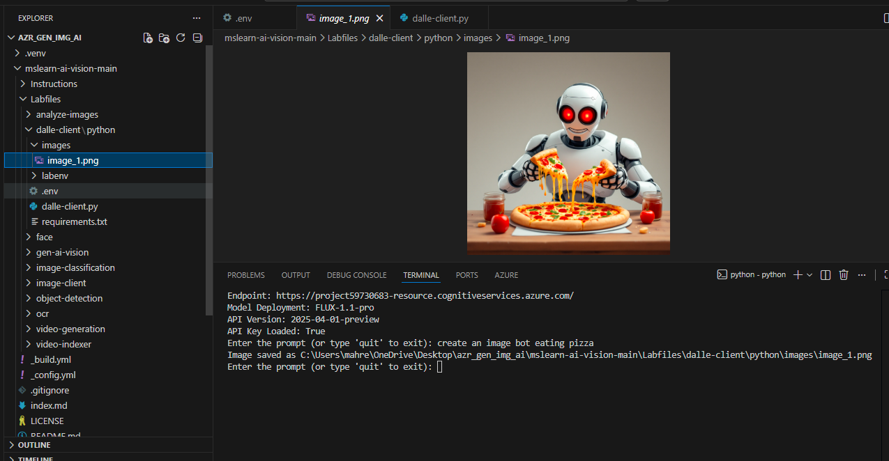
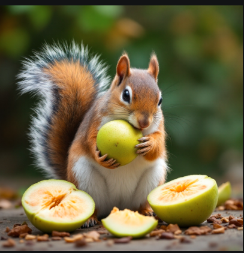

# 🧠 Azure AI Image Generator

An AI-powered image generator built using Azure OpenAI that converts text prompts into high-quality images using Python.

---

## 🚀 Features

- 🔹 Text to Image generation
- 🔹 Uses Azure OpenAI (DALL·E / FLUX)
- 🔹 Saves images automatically
- 🔹 Simple CLI-based interaction

---

## 🛠️ Tech Stack

- Python
- Azure OpenAI
- dotenv
- Base64

---

## ▶️ How to Run

1. Add your API details in `.env`
2. Run:

---

## 🖼️ Sample Outputs

### 🤖 Robot eating pizza

### 🐿️ Squirrel eating guava

---

## 📌 Description

Built an AI-powered image generator using Azure OpenAI that converts text prompts into high-quality images. Demonstrates API integration, prompt engineering, and real-time image generation using Python.

---

## 🔐 Note

Do NOT upload `.env` file (contains API key)

---

## 👨‍💻 Author

Ayesha Mehreen  
GitHub: https://github.com/ayeshamehreentech